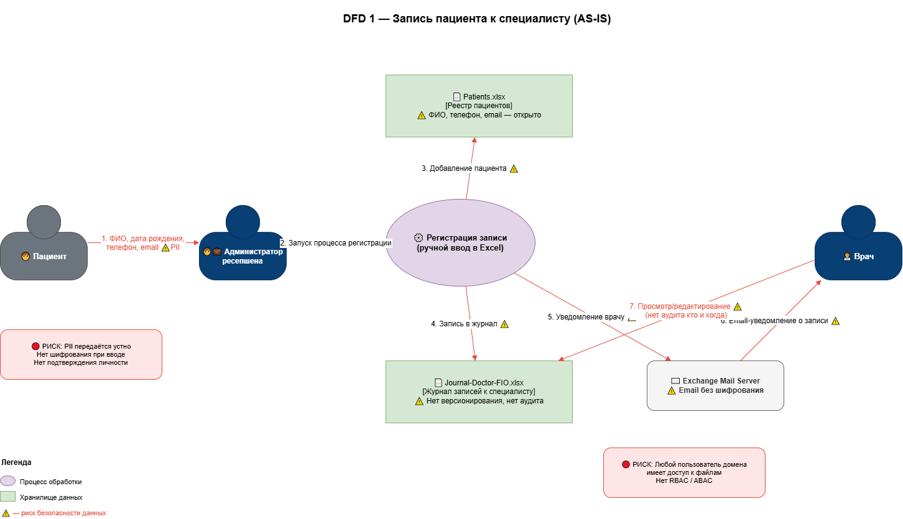
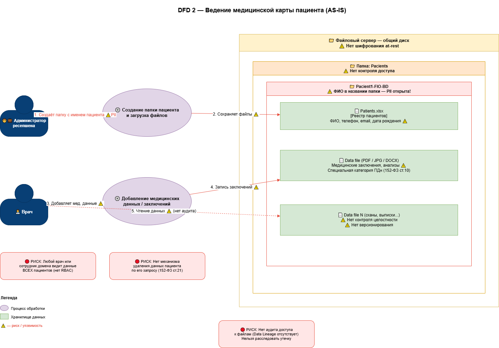
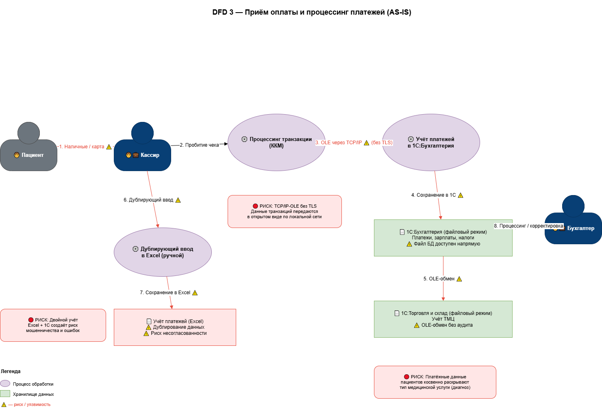
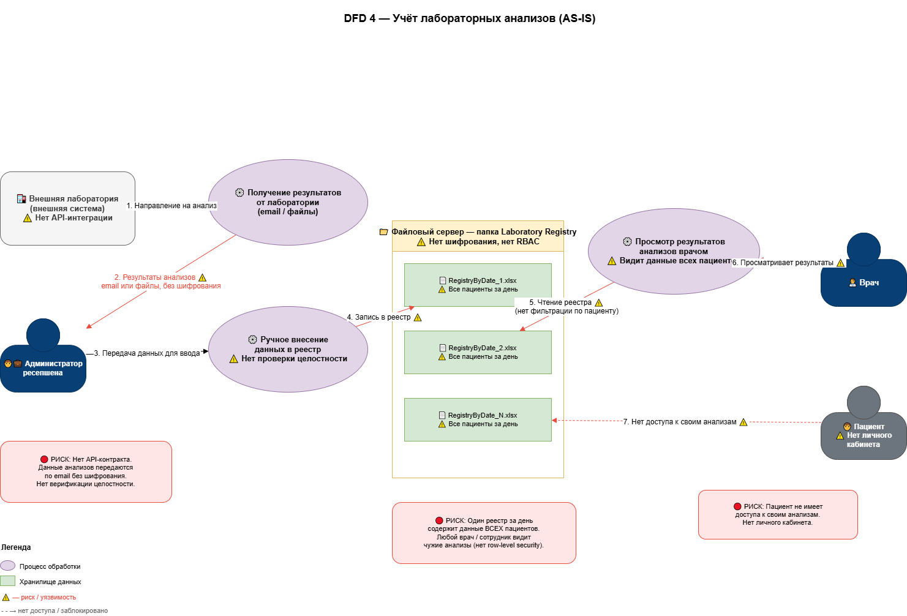
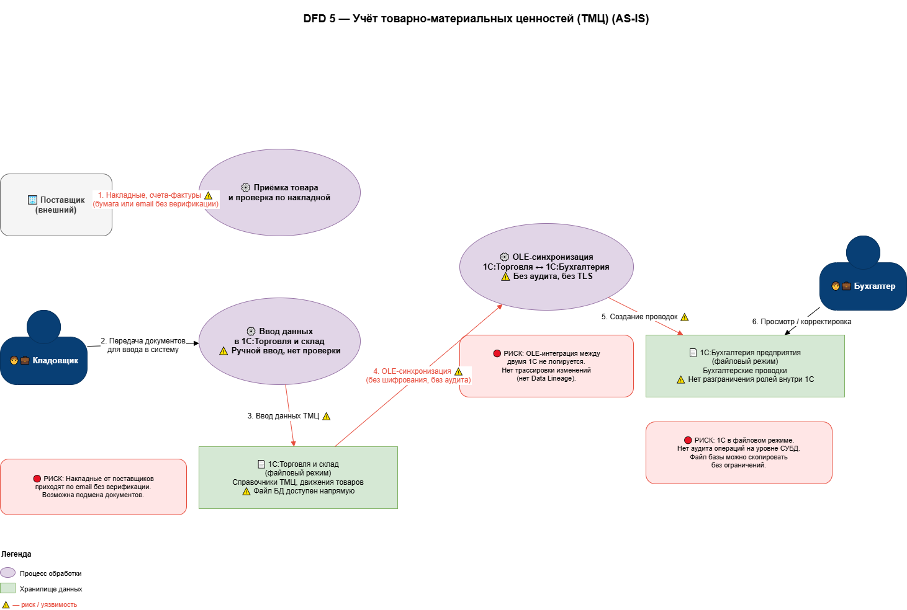

# Диаграммы потоков данных (DFD)

## 1. Регистрация и запись к специалисту

## 2. Ведение медкарт пациентов

## 3. Приём оплаты и процессинг

## 4. Учёт анализов и работа с лабораторией

## 5. Учёт товарно-материальных ценностей (ТМЦ)

